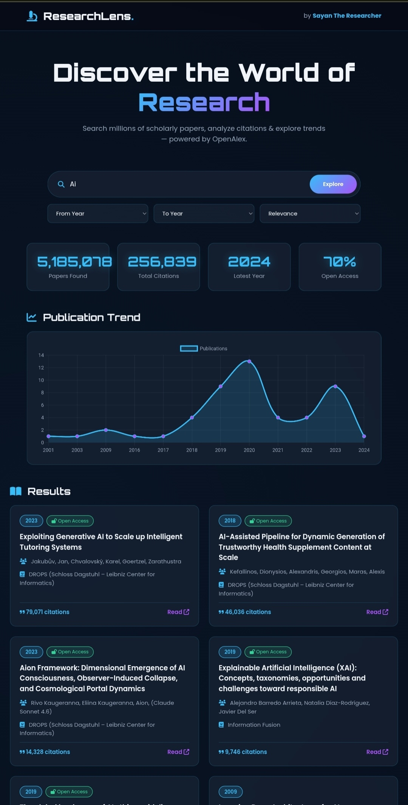

<div align="center">




# 🔬 ResearchLens

### Discover the World of Research 


[](https://sayan9168.github.io/researchlens)
[](https://sayan9168.github.io)

**An intelligent research discovery tool to explore millions of scholarly papers, analyze citations & visualize publication trends — powered by the OpenAlex API.**

[Features](#-features) • [Demo](#-live-demo) • [Tech Stack](#-tech-stack) • [Usage](#-how-to-use) • [Author](#-author)

</div>

---

## 📖 Overview

**ResearchLens** is a modern, lightweight web application that allows researchers, students, and curious minds to search through **millions of scholarly papers** in real time. Built on top of the free and open **OpenAlex** scholarly database, it provides instant insights into citations, publication trends, and open-access availability — all without requiring any API key or backend server.

> 🔍 *"Exploring the boundaries of knowledge through research & code."*

---

## ✨ Features

| Feature | Description |
|---------|-------------|
| 🔎 **Smart Search** | Search millions of research papers by topic or keyword |
| 📊 **Live Statistics** | Real-time count of papers, total citations, and open-access ratio |
| 📈 **Trend Visualization** | Interactive line chart showing publication trends over the years |
| 🔓 **Open Access Detection** | Instantly identify which papers are freely available |
| 🗓️ **Year Filtering** | Narrow results by publication year range |
| 🔀 **Smart Sorting** | Sort by relevance, most cited, or newest first |
| ⚡ **Zero Backend** | Pure frontend — no server, no API key, no cost |
| 📱 **Fully Responsive** | Works beautifully on mobile, tablet, and desktop |

---

## 🖼️ Preview

<div align="center">

| 🔍 Search & Explore | 📈 Publication Trends |
|:---:|:---:|
| *Search any research topic* | *Visualize trends over time* |

> 💡 Add your screenshots here after deploying the project.

</div>

---

## 🛠️ Tech Stack

<div align="center">


</div>

### 📦 Project Structure

```
researchlens/
├── index.html      # Main HTML structure
├── style.css       # Styling & animations
├── app.js          # Core logic & API integration
└── README.md       # Project documentation
```

---

## 🚀 Live Demo

Try it live here:

👉 **[https://sayan9168.github.io/researchlens](https://sayan9168.github.io/researchlens)**

**Example searches to try:**
- `Artificial Intelligence`
- `Quantum Computing`
- `Climate Change`
- `Machine Learning`
- `CRISPR Gene Editing`

---

## 💻 How to Use

1. **Open** the [live demo](https://sayan9168.github.io/researchlens) in your browser.
2. **Type** a research topic in the search box.
3. *(Optional)* Set a **year range** and choose a **sorting method**.
4. **Click** the **Explore** button.
5. **View** the results, statistics, and trend chart instantly.

---

## 🏃 Run Locally

Want to run it on your own machine? Follow these steps:

```bash
# 1. Clone the repository
git clone https://github.com/sayan9168/researchlens.git

# 2. Move into the project folder
cd researchlens

# 3. Open in your browser
# Option A: Simply double-click index.html
# Option B: Use a local server (recommended)
python -m http.server 8000
# Then visit: http://localhost:8000
```

> ⚠️ **Note:** This project uses the **OpenAlex API**, which is free and requires **no API key**. An internet connection is required to fetch live data.

---

## 🌐 About the Data Source

This project is powered by **[OpenAlex](https://openalex.org)** — a free, open, and comprehensive catalog of global research papers. OpenAlex provides metadata on works, authors, institutions, and citations, making it one of the best open resources for scholarly exploration.

> 🙏 Special thanks to the OpenAlex team for keeping research data open and accessible.

---

## 🤝 Contributing

Contributions are welcome! If you'd like to improve ResearchLens:

1. **Fork** the repository
2. **Create** your feature branch (`git checkout -b feature/AmazingFeature`)
3. **Commit** your changes (`git commit -m 'Add AmazingFeature'`)
4. **Push** to the branch (`git push origin feature/AmazingFeature`)
5. **Open** a Pull Request

---

## 📄 License

This project is licensed under the **MIT License**. Feel free to use, modify, and distribute it.

---

## 👤 Author

<div align="center">


### Sayan Mahata
**Sayan The Researcher** | Researcher & Software Developer

*Exploring the boundaries of knowledge through research & code.*

</div>

| Platform | Link |
|----------|------|
| 🌐 **Portfolio** | [sayan9168.github.io](https://sayan9168.github.io) |
| 💻 **GitHub** | [@sayan9168](https://github.com/sayan9168) |
| 💼 **LinkedIn** | [Sayan Mahata](https://www.linkedin.com/in/sayan-mahata-a8b321391/) |
| 🐦 **Twitter / X** | [@notfound_sayan](https://twitter.com/notfound_sayan) |
| 📸 **Instagram** | [@_sayyyyan](https://www.instagram.com/_sayyyyan) |
| 📧 **Email** | sm6881164@gmail.com |

---

## ⭐ Support the Project

If you found **ResearchLens** useful, please consider giving this repository a ⭐ **star** on GitHub. It motivates me to build more open tools for the research community.

<div align="center">

**Made with ❤️ by [Sayan Mahata](https://sayan9168.github.io) | © 2026 ResearchLens**

`#Research` `#OpenAlex` `#DataVisualization` `#SayanTheResearcher` '#sayan9168'

</div>
